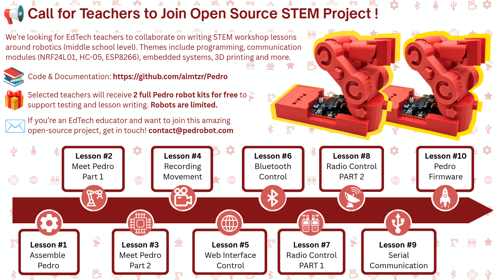

## 🚀 Pedro Project Repositories: 
Each Pedro repository serves a specific role in the ecosystem:

* 📂 [`Pedro`](https://github.com/almtzr/Pedro): 3D printing resources — STL files and assembly instructions for building the Pedro robot chassis.
* 📂 [`Pedro Board`](https://github.com/almtzr/PedroBoard): Hardware design — Gerber files, schematics, and PCB layouts for the Pedro controller board.
* 📂 [`Pedro Robot`](https://github.com/almtzr/PedroRobot): Firmware — Arduino source code and library to program and control the Pedro robot.
* 📂 [`Pedro STEM`](https://github.com/almtzr/PedroSTEM): Education — STEM lessons, activities, and teaching material using the Pedro robot for schools.

# 📂 `Pedro STEM`

  

## STEM Lessons

* [Lesson n°1: Discover Robotics by Building Pedro](https://almtzr.github.io/PedroSTEM/stem_lessons/Pedro_Lesson_1.pdf)
* [Lesson n°2: Explore the Various Control Modes](https://almtzr.github.io/PedroSTEM/stem_lessons/Pedro_Lesson_2.pdf) (work in progress...)
* [Lesson n°3: Manual Mode](https://almtzr.github.io/PedroSTEM/stem_lessons/Pedro_Lesson_3.pdf) (work in progress...)
* [Lesson n°4: Record & Replay Mode](https://almtzr.github.io/PedroSTEM/stem_lessons/Pedro_Lesson_4.pdf) (work in progress...)
* [Lesson n°5: Radio Mode](https://almtzr.github.io/PedroSTEM/stem_lessons/Pedro_Lesson_5.pdf) (work in progress...)
* [Lesson n°6: USB Mode](https://almtzr.github.io/PedroSTEM/stem_lessons/Pedro_Lesson_6.pdf) (work in progress...)
* [Lesson n°7: Bluetooth Mode](https://almtzr.github.io/PedroSTEM/stem_lessons/Pedro_Lesson_7.pdf) (work in progress...)
* [Lesson n°8: External Mode](https://almtzr.github.io/PedroSTEM/stem_lessons/Pedro_Lesson_8.pdf) (work in progress...)
* [Lesson n°9: Pedro & Arduino Uno](https://almtzr.github.io/PedroSTEM/stem_lessons/Pedro_Lesson_9.pdf) (work in progress...)
* [Lesson n°10: Pedro & Raspberry Pi](https://almtzr.github.io/PedroSTEM/stem_lessons/Pedro_Lesson_10.pdf) (work in progress...)
