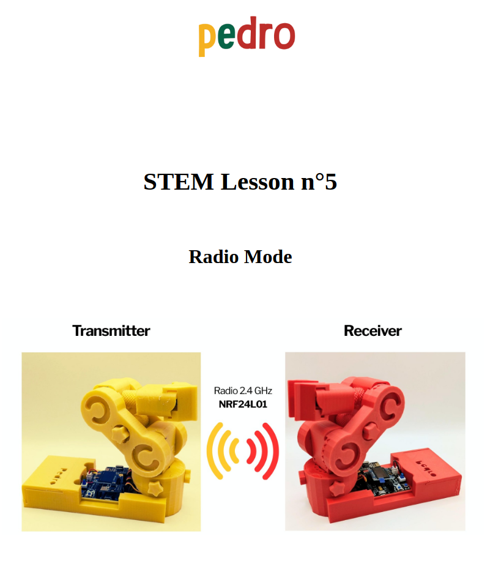

## 🚀 Pedro Project Repositories: 
Each Pedro repository serves a specific role in the ecosystem:

* 📂 [`Pedro`](https://github.com/almtzr/Pedro): 3D printing resources — STL files and assembly instructions for building the Pedro robot chassis.
* 📂 [`Pedro Board`](https://github.com/almtzr/PedroBoard): Hardware design — Gerber files, schematics, and PCB layouts for the Pedro controller board.
* 📂 [`Pedro Robot`](https://github.com/almtzr/PedroRobot): Firmware — Arduino source code and library to program and control the Pedro robot.
* 📂 [`Pedro STEM`](https://github.com/almtzr/PedroSTEM): Education — STEM lessons, activities, and teaching material using the Pedro robot for schools.

# 📂 `Pedro STEM`
## STEM Lessons available on https://pedrobot.com

  

