## 🚀 Pedro Project Repositories: 
Each Pedro repository serves a specific role in the ecosystem:

* 📂 [`Pedro`](https://github.com/almtzr/Pedro): 3D printing resources — STL files and assembly instructions for building the Pedro robot chassis.
* 📂 [`Pedro Board`](https://github.com/almtzr/PedroBoard): Hardware design — Gerber files, schematics, and PCB layouts for the Pedro controller board.
* 📂 [`Pedro Robot`](https://github.com/almtzr/PedroRobot): Firmware — Arduino source code and library to program and control the Pedro robot.
* 📂 [`Pedro STEM`](https://github.com/almtzr/PedroSTEM): Education — STEM lessons, activities, and teaching material using the Pedro robot for schools.

# 📂 `Pedro STEM`

## Complete all 10 Pedro STEM Lessons, collect every Pedro Badge, and become an official PEDRO MAKER! 🏆

     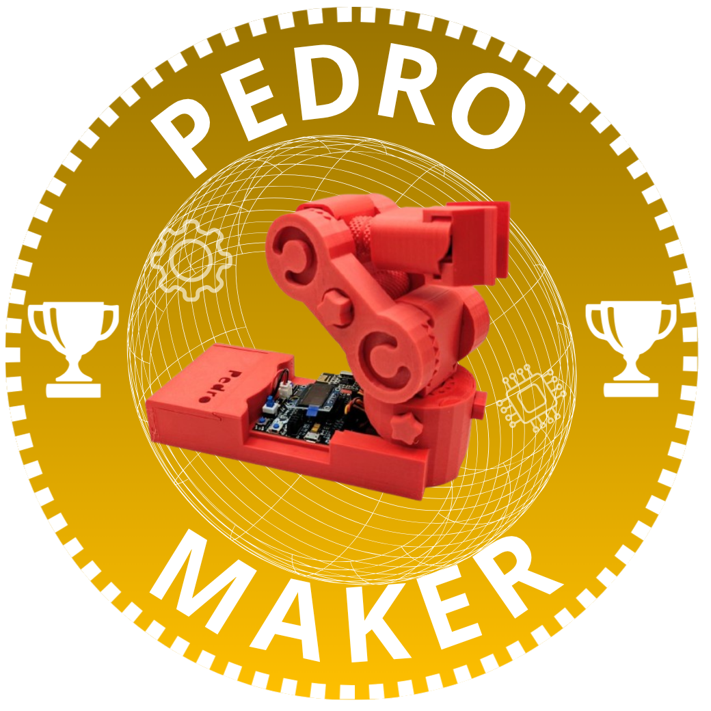

     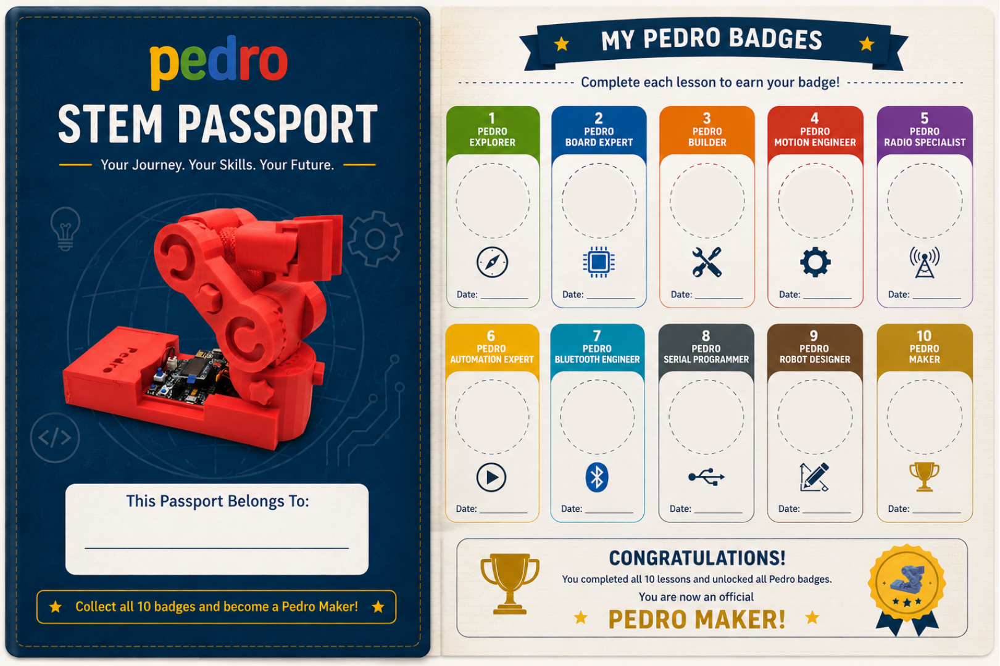

 
 

    <a href="https://almtzr.github.io/PedroSTEM/stem_lessons/Pedro_Lesson_1.pdf?v=20260715">
        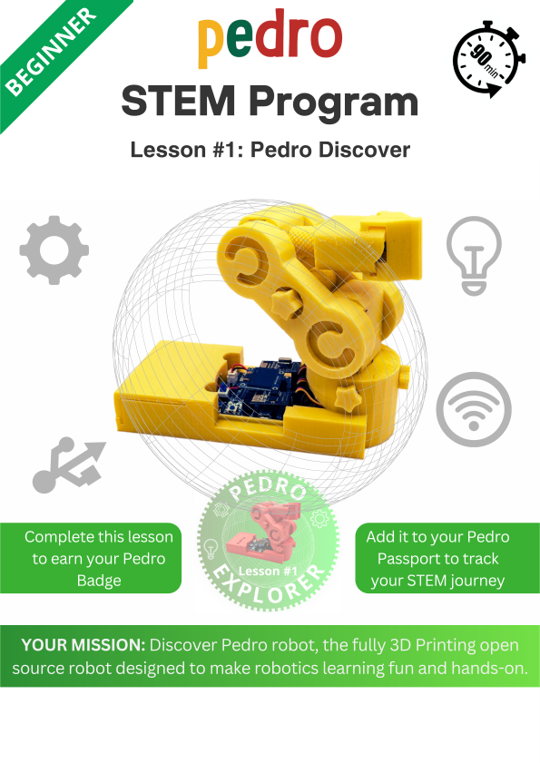
    </a>
    <a href="https://almtzr.github.io/PedroSTEM/stem_lessons/Pedro_Lesson_2.pdf?v=20260715">
        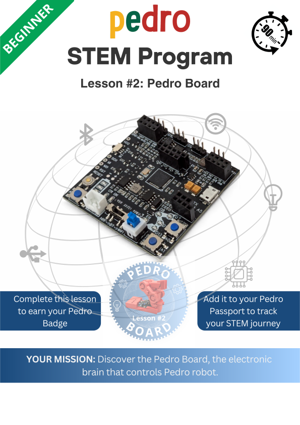
    </a>

    <a href="https://almtzr.github.io/PedroSTEM/stem_lessons/Pedro_Lesson_3.pdf?v=20260715">
        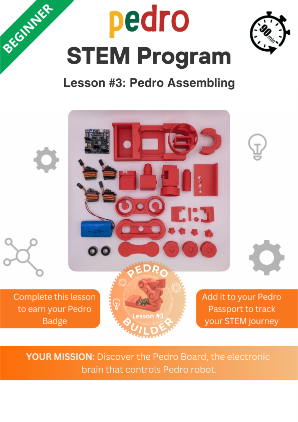
    </a>
    <a href="https://almtzr.github.io/PedroSTEM/stem_lessons/Pedro_Lesson_4.pdf?v=20260715">
        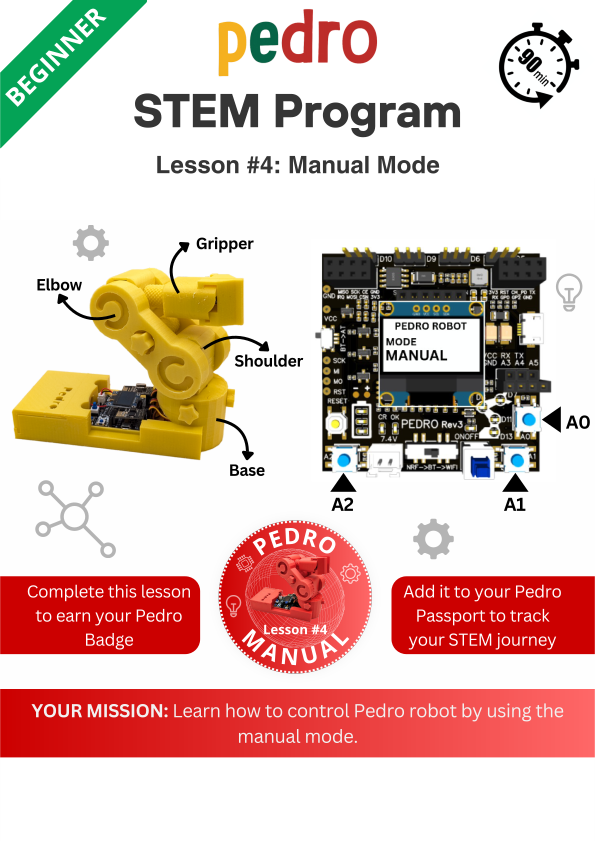
    </a>

    <a href="https://almtzr.github.io/PedroSTEM/stem_lessons/Pedro_Lesson_5.pdf?v=20260715">
        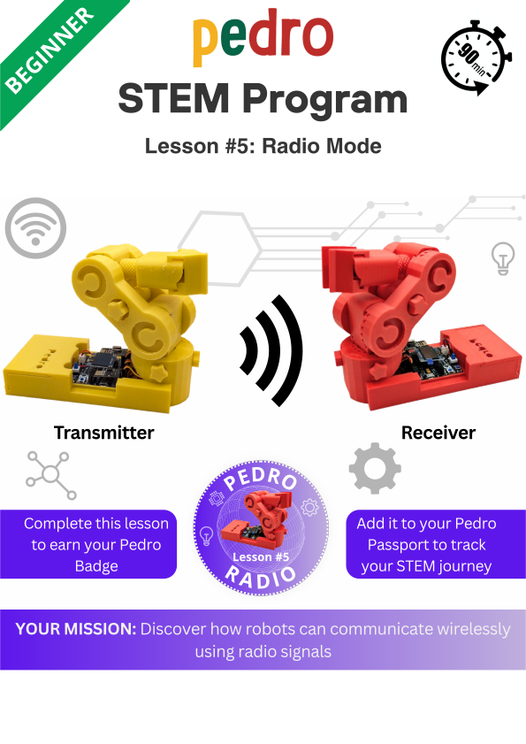
    </a>
    <a href="https://almtzr.github.io/PedroSTEM/stem_lessons/Pedro_Lesson_6.pdf?v=20260715">
        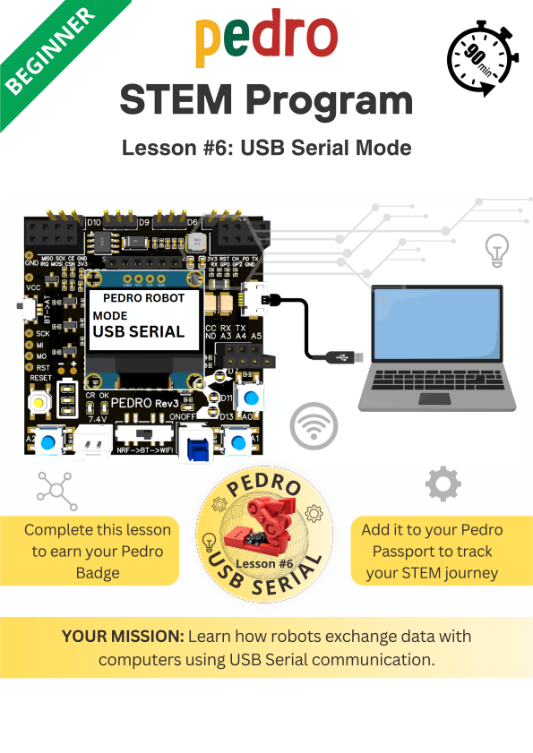
    </a>

    <a href="https://almtzr.github.io/PedroSTEM/stem_lessons/Pedro_Lesson_7.pdf?v=20260715">
        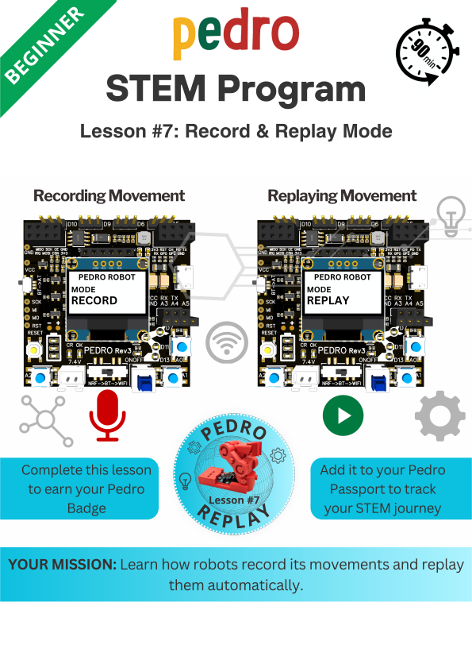
    </a>
    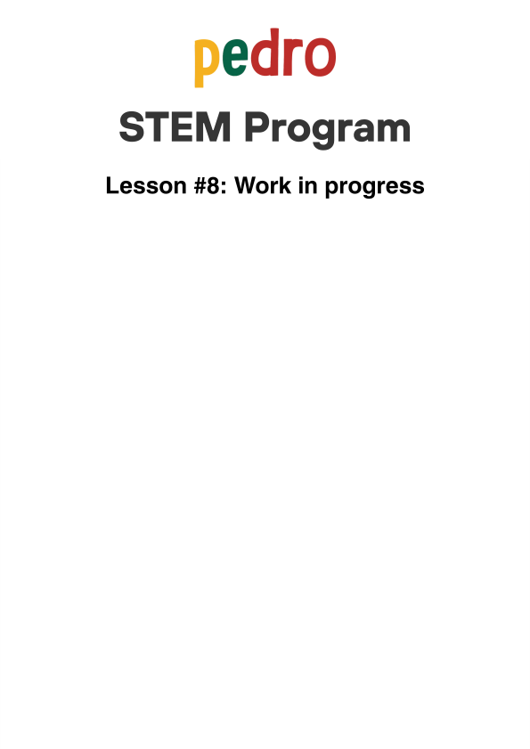

    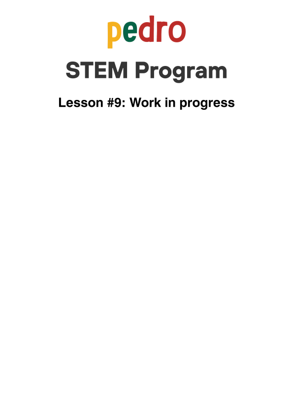
    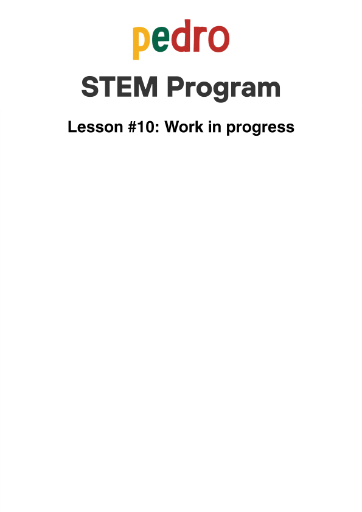

